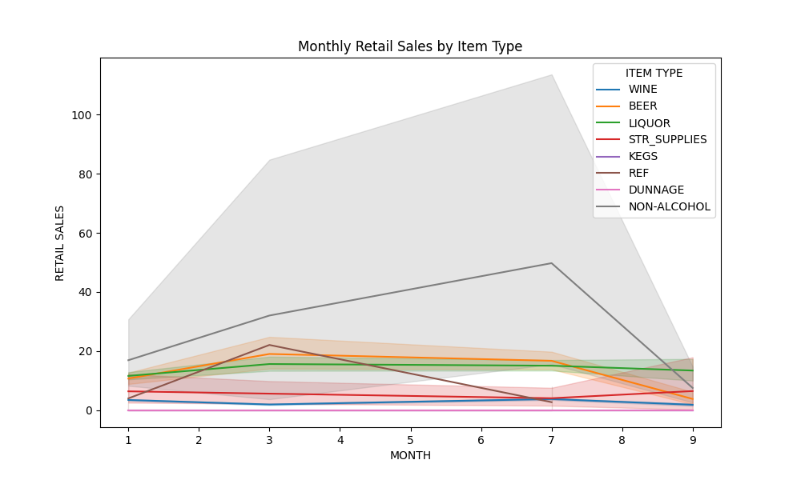
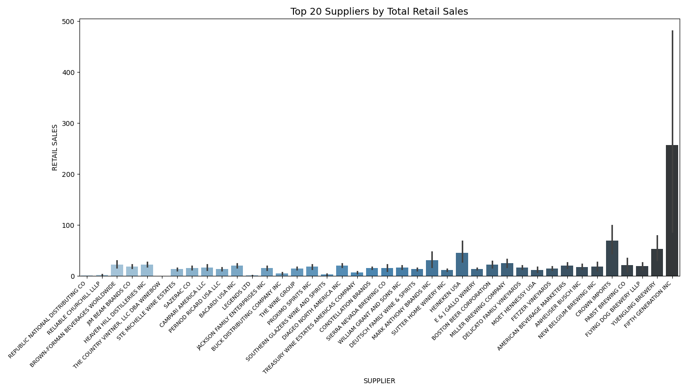

# Retail-and-Warehouse-Sale-analysis

## Overview
This project analyzes retail sales data to uncover and visualize insights related to sales performance, supplier contributions, and item trends. Key aspects of the analysis include:

- **Sales Revenue**: Total revenue generated from retail and warehouse sales.
- **Supplier Performance**: Evaluating the contribution of each supplier.
- **Item Trends**: Analysis of sales trends based on item type.

## Dataset
- **Retail Sales Data**: Contains information on sales, transfers, and supplier details, over a nine month period. Cleaned data is stored in `cleaned_retail_sales_data.csv`.

## Steps
1. **Data Preprocessing**: Run the `data_preprocessing.py` script to clean and prepare the dataset.
2. **Data Analysis**: Use the `retail_sales_analysis.py` notebook for visualizations and insights.

## Results
Key visualizations generated:
- **Monthly Retail Sales by Item Type**
- **Total Sales by Supplier**

## Visualizations

  
  

### Key Conclusions:
- **Sales Trend**: The analysis of retail sales over time reveals consistent sales growth during a nine month period, highlighting peak sales around key retail months such as November and December. These months correlate with high seasonal demand, such as the holiday shopping season, demonstrating the impact of seasonality on retail performance.

- **Top Suppliers Sales**: The top-performing suppliers contribute a significant portion of total sales, with a clear concentration among the leading few. This suggests that a small number of suppliers play a disproportionately large role in driving revenue, making supplier management critical for optimizing sales performance.

